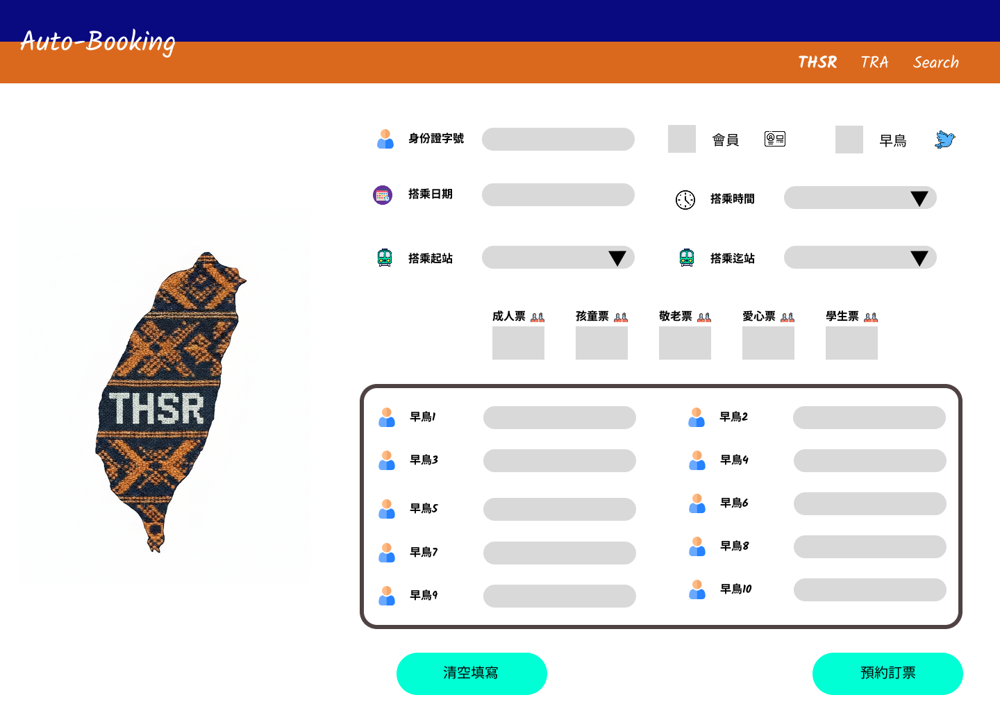
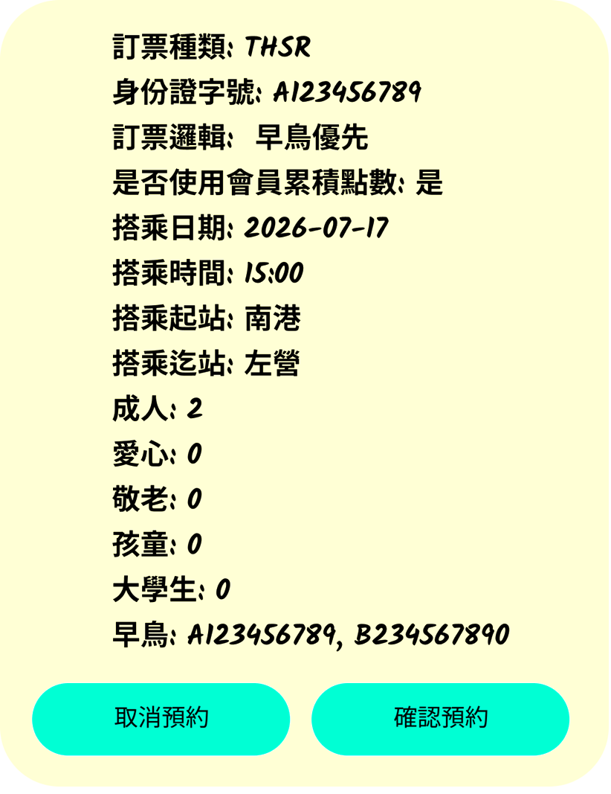

# 高鐵預約訂票(前端)

## I. 需求簡介

前端提供使用者操作介面，使用者可以透過此介面進行高鐵的預約訂票

## II. 需求說明

- 請根據**高鐵預約訂票介面**顯示設計前端畫面，並且根據Component需求進行組裝前端，若有需求未指定的Component，請與PM討論再開發，請勿自行開發Component
- 參考API格式: [THSR訂票上下行電文](../../api/Booking_THSR.md)
- Component需求定義:
  - 身份證字號
    - 使用[ID Component](../requirements/ID_Component.md)
    - Title: 身份證字號
    - Placeholder: 請輸入身份證字號
    - JsonKey: user_id
  - 會員資格:
    - 使用[CheckBox Component](../requirements/Checkbox_Component.md)
    - Title: 使用高鐵會員
    - Icon: 使用**public/icons/membership.png**
    - 預設不勾選
    - 非必填欄位
    - JsonKey: is_member
  - 搭乘日期:
    - 使用[Date Component](../requirements/Date_Component.md)
    - Title: 搭乘日期
    - 必填
    - JsonKey: booking_date
  - 搭乘時間:
    - 使用[Select Component](../requirements/Selection_Component.md)
    - Title: 搭乘時間
    - Icon: 使用**public/icons/clock.png**
    - parm_category: THSR_TIME
    - 必填
    - JsonKey: booking_time
  - 搭乘起站:
    - 使用[Select Component](../requirements/Selection_Component.md)
    - Title: 搭乘起站
    - Icon: 使用**public/icons/transport.png**
    - parm_category: THSR_STATION
    - 必填
    - JsonKey: start_station
  - 搭乘迄站:
    - 使用[Select Component](../requirements/Selection_Component.md)
    - Title: 搭乘迄站
    - Icon: 使用**public/icons/transport.png**
    - parm_category: THSR_STATION
    - 必填
    - JsonKey: end_station
  - 購買票券數量需求:
    - 總輸入數量不可以超過10張，由選**預約訂票**按鈕進行檢查
    - 成人票:
      - 使用[Number Component](../requirements/Number_Component.md)
      - Title: 成人票
      - Icon: 使用**public/icons/people.png**
      - 預設為0張
      - 必填
      - JsonKey: adults
    - 兒童票:
      - 使用[Number Component](../requirements/Number_Component.md)
      - Title: 兒童票
      - Icon: 使用**public/icons/children.png**
      - 預設為0張
      - 必填
      - JsonKey: childs
    - 敬老票:
      - 使用[Number Component](../requirements/Number_Component.md)
      - Title: 敬老票
      - Icon: 使用**public/icons/elderly.png**
      - 預設為0張
      - 必填
      - JsonKey: elders
    - 愛心票:
      - 使用[Number Component](../requirements/Number_Component.md)
      - Title: 愛心票
      - Icon: 使用**public/icons/disabled.png**
      - 預設為0張
      - 必填
      - JsonKey: disables
    - 學生票:
      - 使用[Number Component](../requirements/Number_Component.md)
      - Title: 學生票
      - Icon: 使用**public/icons/students.png**
      - 預設為0張
      - 必填
      - JsonKey: students
  - 購買早鳥票需求:
    - 預約日期在T+1~T+5時，早鳥票輸入框不顯示
    - 預約日期為T+6時，根據**成人票數量**顯示早鳥ID輸入框
    - 有顯示則一律**必填**
    - 所有的早鳥ID不可重複
    - 早鳥ID輸入:
      - 使用[ID Component](../requirements/ID_Component.md)
      - Title: 早鳥1(1~10根據成人票數量顯示)
    - JsonKey: early_ids，為陣列格式，依序放入早鳥ID的值

### III. 前端顯示畫面

