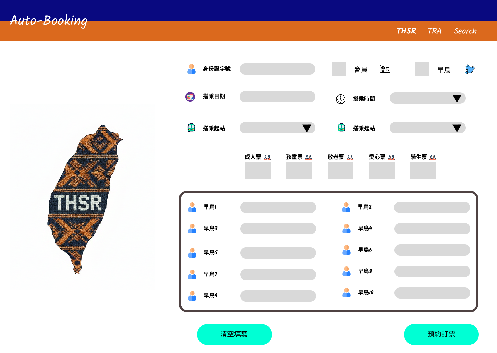

# 高鐵預約訂票(前端)

## I. 需求簡介

前端提供使用者操作介面，使用者可以透過此介面進行高鐵的預約訂票

## II. 需求說明

- 請根據**高鐵預約訂票介面**顯示設計前端畫面，並且根據Component需求進行組裝前端，若有需求未指定的Component，請與PM討論再開發，請勿自行開發Component
- 參考API格式: [THSR訂票上下行電文](../../api/Booking_THSR.md)
- Component需求定義:
  - 身份證字號
    - 使用[ID Component](../requirements/ID_Component.md)
    - Title: 身份證字號
    - Placeholder: 請輸入身份證字號
    - JsonKey: user_id
  - 會員資格:
    - 使用[CheckBox Component](../requirements/Checkbox_Component.md)
    - Title: 使用高鐵會員
    - Icon: 使用**public/icons/membership.png**
    - 預設不勾選
    - 非必填欄位
    - JsonKey: is_member
  - 早鳥優先:
    - 使用[CheckBox Component](../requirements/Checkbox_Component.md)
    - Title: 早鳥優先
    - Icon: 使用**public/icons/early.png**
    - 預設不勾選
    - 非必填欄位
    - JsonKey: is_early_bird
  - 搭乘日期:
    - 使用[Date Component](../requirements/Date_Component.md)
    - Title: 搭乘日期
    - 必填
    - JsonKey: booking_date
  - 搭乘時間:
    - 使用[Select Component](../requirements/Selection_Component.md)
    - Title: 搭乘時間
    - Icon: 使用**public/icons/clock.png**
    - parm_category: THSR_TIME
    - 必填
    - JsonKey: booking_time
  - 搭乘起站:
    - 使用[Select Component](../requirements/Selection_Component.md)
    - Title: 搭乘起站
    - Icon: 使用**public/icons/transport.png**
    - parm_category: THSR_STATION
    - 必填
    - JsonKey: start_station
  - 搭乘迄站:
    - 使用[Select Component](../requirements/Selection_Component.md)
    - Title: 搭乘迄站
    - Icon: 使用**public/icons/transport.png**
    - parm_category: THSR_STATION
    - 必填
    - JsonKey: end_station
  - 購買票券數量需求:
    - 總輸入數量不可以超過10張，由選**預約訂票**按鈕進行檢查
    - 成人票:
      - 使用[Number Component](../requirements/Number_Component.md)
      - Title: 成人票
      - Icon: 使用**public/icons/people.png**
      - 預設為1張
      - 必填
      - JsonKey: adults
    - 兒童票:
      - 使用[Number Component](../requirements/Number_Component.md)
      - Title: 兒童票
      - Icon: 使用**public/icons/children.png**
      - 預設為0張
      - 必填
      - JsonKey: childs
    - 敬老票:
      - 使用[Number Component](../requirements/Number_Component.md)
      - Title: 敬老票
      - Icon: 使用**public/icons/elderly.png**
      - 預設為0張
      - 必填
      - JsonKey: elders
    - 愛心票:
      - 使用[Number Component](../requirements/Number_Component.md)
      - Title: 愛心票
      - Icon: 使用**public/icons/disabled.png**
      - 預設為0張
      - 必填
      - JsonKey: disables
    - 學生票:
      - 使用[Number Component](../requirements/Number_Component.md)
      - Title: 學生票
      - Icon: 使用**public/icons/students.png**
      - 預設為0張
      - 必填
      - JsonKey: students
  - 購買早鳥票需求:
    - 預約日期在T+1~T+5時，早鳥票輸入框不顯示
    - 預約日期為T+6時，根據**成人票數量**顯示早鳥ID輸入框
    - 有顯示則一律**必填**
    - 所有的早鳥ID不可重複
    - 早鳥ID輸入:
      - 使用[ID Component](../requirements/ID_Component.md)
      - Title: 早鳥1(1~10根據成人票數量顯示)
    - JsonKey: early_ids，為陣列格式，依序放入早鳥ID的值
  - 清空填寫按鈕
    - 使用[Button Component](../requirements/Button_Component.md)
    - Title: 清空填寫
    - Icon: 使用**public/icons/school.png**
    - ButtonColor: #FFCCCC
    - SelectedColor: #f73f3f
    - ButtonSize: medium
    - OnClick事件: 清空所有欄位的值，並且將所有的欄位回復到預設值
  - 預約訂票按鈕
    - 使用[Button Component](../requirements/Button_Component.md)
    - Title: 預約訂票
    - Icon: 使用**public/icons/booking.png**
    - ButtonColor: #a7fdb9
    - SelectedColor: #59fa59
    - ButtonSize: medium
    - OnClick事件: 進行欄位檢查，是否正確
      - 若有欄位未填寫或是有錯誤，則跳出錯誤提示窗顯示"相關欄位未填寫或有誤，請確認"
      - 若所有欄位皆正確，則跳出確認視窗顯示"請確認是否要進行預約訂票"，並且顯示所有的欄位值，若使用者按下**確認**，則將所有欄位值依照API格式進行POST送出，若使用者按下**取消**，則關閉視窗並保留輸入狀態
  - 欄位檢查: 需檢查欄位**是否符合必填**、**ID輸入確定性**、**早鳥ID是否重複**、**票券數量是否超過10張**、**起訖站別是否相同**，並且根據檢查結果跳出[提示視窗](../requirements/Hint_Component.md)
  - Double Check檢查：若通過**欄位檢查**，則跳出[Double Check視窗](../requirements/DoubleCheck_Compoent.md)顯示所有欄位值，並且詢問使用者是否要進行預約訂票，當使用者點選**確認**，則將所有欄位值依照[API格式](../../api/Booking_THSR.md)送出，若使用者按下**取消**，則關閉視窗並保留輸入狀態
  - 相關Unit Test Case: [Booking_THSR.feature](../scenarios/Booking_THSR.feature)

## III. 前端顯示畫面




### IV. HTML排版結構

```html
<!DOCTYPE html>
<html lang="zh-TW">
  <head>
    <meta charset="utf-8" />
    <meta name="viewport" content="width=device-width, initial-scale=1" />
    <title>THSR Auto-Booking Layout</title>
    <style>
      * {
        box-sizing: border-box;
        margin: 0;
        padding: 0;
      }
      body {
        font-family: sans-serif;
        background: #f0f0f0;
      }
      .page {
        width: 1440px;
        min-height: 1024px;
        background: #fff;
        margin: 0 auto;
      }

      /* Header: 上藍下橘雙色條 */
      .header-blue {
        height: 60px;
        background: #090980;
      }
      .header-orange {
        height: 60px;
        background: #db691d;
        display: flex;
        align-items: center;
        justify-content: space-between;
        padding: 0 28px;
      }
      .header-orange h1 {
        color: #fff;
        font-size: 40px;
        font-weight: 400;
      }
      .header-orange nav {
        display: flex;
        gap: 24px;
      }
      .header-orange nav a {
        color: #fff;
        font-size: 24px;
        text-decoration: none;
      }
      .header-orange nav a.active {
        font-weight: 700;
        text-decoration: underline;
      }

      /* 主區：左側地圖 + 右側表單 */
      .main {
        display: flex;
      }
      .sidebar {
        width: 460px;
        display: flex;
        align-items: center;
        justify-content: center;
      }
      .map-placeholder {
        width: 300px;
        height: 400px;
        border: 2px dashed #999;
        border-radius: 40%;
        display: flex;
        align-items: center;
        justify-content: center;
        font-size: 48px;
        font-weight: 700;
        color: #333;
      }
      .form-area {
        flex: 1;
        padding: 20px 40px 20px 0;
        display: flex;
        flex-direction: column;
        gap: 16px;
      }

      /* 表單列 */
      .row {
        display: flex;
        gap: 24px;
        align-items: center;
      }
      .field {
        display: flex;
        align-items: center;
        gap: 8px;
        flex: 1;
      }
      .field label {
        font-size: 16px;
        font-weight: 700;
        white-space: nowrap;
      }
      .field input,
      .field select {
        flex: 1;
        height: 33px;
        border: 1px solid #ccc;
        border-radius: 30px;
        padding: 0 14px;
        background: #f5f5f5;
      }
      .member-group {
        display: flex;
        gap: 10px;
        align-items: center;
      }
      .member-group button {
        border: 1px solid #ccc;
        border-radius: 8px;
        padding: 6px 14px;
        background: none;
        cursor: pointer;
        font-size: 16px;
      }

      /* 票種列 */
      .tickets {
        display: flex;
        gap: 20px;
        justify-content: center;
        padding: 8px 0;
      }
      .ticket {
        text-align: center;
        min-width: 90px;
      }
      .ticket span {
        display: block;
        font-weight: 700;
        margin-bottom: 4px;
      }
      .ticket input {
        width: 60px;
        height: 30px;
        text-align: center;
        border: 1px solid #ccc;
        border-radius: 15px;
      }

      /* 早鳥區 */
      .early-bird {
        border: 1px solid #ddd;
        border-radius: 25px;
        padding: 20px;
        display: grid;
        grid-template-columns: 1fr 1fr;
        gap: 12px 32px;
      }
      .eb-row {
        display: flex;
        align-items: center;
        gap: 8px;
      }
      .eb-row label {
        font-weight: 700;
        white-space: nowrap;
        min-width: 50px;
      }
      .eb-row input {
        flex: 1;
        height: 33px;
        border: 1px solid #ccc;
        border-radius: 30px;
        padding: 0 14px;
        background: #f5f5f5;
      }

      /* 底部按鈕 */
      .actions {
        display: flex;
        justify-content: space-between;
        padding-top: 12px;
      }
      .actions button {
        padding: 14px 48px;
        border: none;
        border-radius: 50px;
        font-size: 20px;
        cursor: pointer;
        background: #3ee6c8;
        min-width: 200px;
      }
    </style>
  </head>
  <body>
    <div class="page">
      <!-- ===== Header（上藍下橘雙色條）===== -->
      <div class="header-blue"></div>
      <div class="header-orange">
        <h1>Auto-Booking</h1>
        <nav>
          <a href="#" class="active">THSR</a>
          <a href="#">TRA</a>
          <a href="#">Search</a>
        </nav>
      </div>

      <div class="main">
        <!-- ===== 左側：台灣地圖佔位 ===== -->
        <div class="sidebar">
          <div class="map-placeholder">THSR</div>
        </div>

        <!-- ===== 右側：訂票表單 ===== -->
        <div class="form-area">
          <!-- 第一列：身份證字號 ＋ 會員/返回/早鳥 -->
          <div class="row">
            <div class="field" style="flex:1.5">
              <label>👤 身份證字號</label>
              <input type="text" placeholder="請輸入身份證字號" />
            </div>
            <div class="member-group">
              <button>會員</button>
              <button>返回</button>
              <button>早鳥</button>
            </div>
          </div>

          <!-- 第二列：搭乘日期 ＋ 搭乘時間 -->
          <div class="row">
            <div class="field">
              <label>📅 搭乘日期</label>
              <input type="date" />
            </div>
            <div class="field">
              <label>🕐 搭乘時間</label>
              <select>
                <option>請選擇時間</option>
              </select>
            </div>
          </div>

          <!-- 第三列：搭乘起站 ＋ 搭乘迄站 -->
          <div class="row">
            <div class="field">
              <label>🚉 搭乘起站</label>
              <select>
                <option>請選擇起站</option>
              </select>
            </div>
            <div class="field">
              <label>🚉 搭乘迄站</label>
              <select>
                <option>請選擇迄站</option>
              </select>
            </div>
          </div>

          <!-- 票種選擇（5 種票） -->
          <div class="tickets">
            <div class="ticket">
              <span>成人票 👤</span><input type="number" value="0" min="0" />
            </div>
            <div class="ticket">
              <span>孩童票 👤</span><input type="number" value="0" min="0" />
            </div>
            <div class="ticket">
              <span>敬老票 👤</span><input type="number" value="0" min="0" />
            </div>
            <div class="ticket">
              <span>愛心票 👤</span><input type="number" value="0" min="0" />
            </div>
            <div class="ticket">
              <span>學生票 👤</span><input type="number" value="0" min="0" />
            </div>
          </div>

          <!-- 早鳥區（2 欄 × 5 列 = 10 格） -->
          <div class="early-bird">
            <div class="eb-row">
              <label>👤 早鳥1</label><input type="text" />
            </div>
            <div class="eb-row">
              <label>👤 早鳥2</label><input type="text" />
            </div>
            <div class="eb-row">
              <label>👤 早鳥3</label><input type="text" />
            </div>
            <div class="eb-row">
              <label>👤 早鳥4</label><input type="text" />
            </div>
            <div class="eb-row">
              <label>👤 早鳥5</label><input type="text" />
            </div>
            <div class="eb-row">
              <label>👤 早鳥6</label><input type="text" />
            </div>
            <div class="eb-row">
              <label>👤 早鳥7</label><input type="text" />
            </div>
            <div class="eb-row">
              <label>👤 早鳥8</label><input type="text" />
            </div>
            <div class="eb-row">
              <label>👤 早鳥9</label><input type="text" />
            </div>
            <div class="eb-row">
              <label>👤 早鳥10</label><input type="text" />
            </div>
          </div>

          <!-- 底部按鈕 -->
          <div class="actions">
            <button>清空填寫</button>
            <button>預約訂票</button>
          </div>
        </div>
      </div>
    </div>
  </body>
</html>
```
