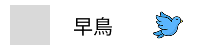

# CheckBox Component

## I. 需求簡介

提供使用者可以選擇是否勾選，並且開發者可以根據需求設定設定選項數量與選項內容，當使用者勾選或取消勾選時，會觸發onChange事件，並且回傳目前的勾選狀態給父層元件使用。

## II. 需求說明

- CSS需要有RWD功能
- Props設定:
  - CheckBox選項設定:
    - Icon: 可提供開發者放入不同的icon顯示
    - 選項文字: 可提供開發者設定checkbox的label文字
    - value值: 可提供開發者設定checkbox的value值
    - 是否預設勾選: 可提供開發者設定checkbox的預設勾選狀態
  - 設定是否為必填
- 排版格式請參考以下:
    - 有Icon: [Checkbox] [選項文字] [Icon]
    - 無Icon: [Checkbox] [選項文字]
- 開發錯誤檢測:
  - 所有選項的Icon需要一致性，需要全有或全無，若有一個選項有Icon，其他選項沒有Icon，則會拋出錯誤訊息，無法進行編譯
  - 所有選項的value值需要唯一，若有重複的value值，則會拋出錯誤訊息，無法進行編譯
- OnChange事件:
  - 當使用者勾選或取消勾選時，會觸發onChange事件，並且回傳目前的勾選狀態給父層元件使用
  - 回傳的資料格式為文字，如果是使用者有進行多選項，則以逗號分開，例如"Value1,Value2,Value3"，若使用者沒有勾選任何選項，則根據開發者設定而決定
    - 必填: 錯誤訊息"請至少勾選一個選項"，並且需要將選項標記為紅色，並且回傳空字串""
    - 不是必填:回傳空字串""

### III. 前端顯示畫面



### IV. React範例說明

```jsx
// Bird.jsx
import React, { useState } from "react";
import "./Bird.css";

function Bird({ checked = false, onChange }) {
  const [isChecked, setIsChecked] = useState(checked);

  const handleToggle = () => {
    const next = !isChecked;
    setIsChecked(next);
    onChange?.(next);
  };

  return (
    <div
      className="bird"
      onClick={handleToggle}
      role="checkbox"
      aria-checked={isChecked}
    >
      <div
        className={`bird__checkbox ${isChecked ? "bird__checkbox--checked" : ""}`}
      >
        {isChecked && <span className="bird__checkmark">✓</span>}
      </div>
      <span className="bird__label">早鳥</span>
      
    </div>
  );
}

export default Bird;
```

### V. CSS範例說明

```css
/* Bird.css */
.bird {
  width: 200px;
  height: 50px;
  background: #ffffff;
  display: flex;
  align-items: center;
  cursor: pointer;
  user-select: none;
}

.bird__checkbox {
  width: 40px;
  height: 40px;
  margin-left: 10px;
  background: #d9d9d9;
  display: flex;
  align-items: center;
  justify-content: center;
  transition: background 0.2s;
}

.bird__checkbox--checked {
  background: #4a90d9;
}

.bird__checkmark {
  color: #ffffff;
  font-size: 20px;
  font-weight: 700;
}

.bird__label {
  font-family: "Kalam", cursive;
  font-weight: 400;
  font-size: 20px;
  color: #000000;
  margin-left: 23px;
}

.bird__icon {
  width: 30px;
  height: 30px;
  margin-left: auto;
  margin-right: 17px;
}
```
