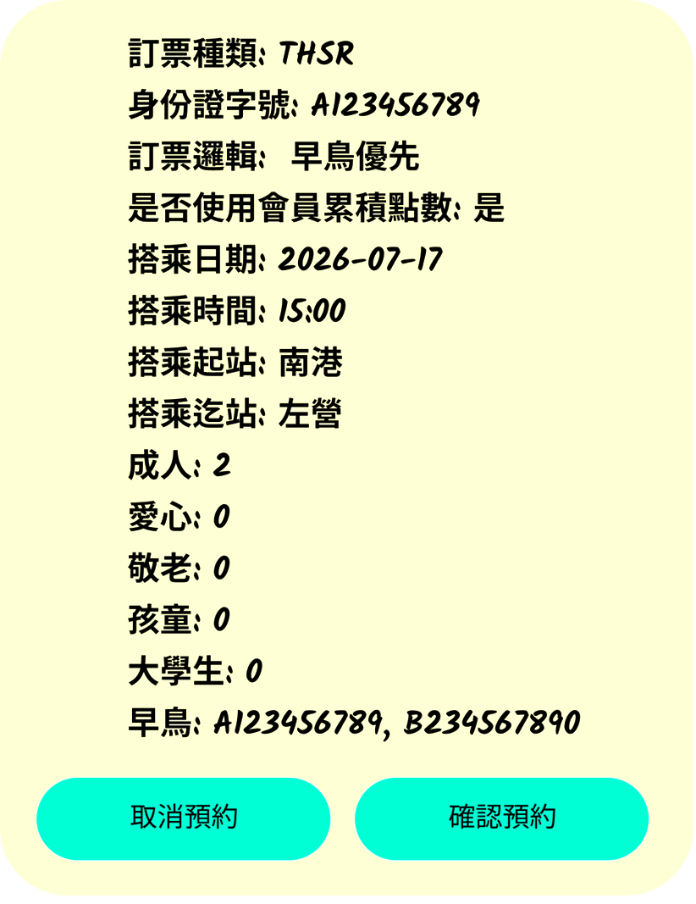

# Double Check Component

## I. 需求說明

當使用者於**THSR**或**TRA**頁面操作時，點擊預約訂票時，會先跳出此視窗，讓使用者確認相關資訊後，當使用者點選**確認訂票**會將使用者資訊送到後端進行訂票，若使用者點選**取消**則會關閉此視窗，並回到原本頁面

## II. 需求說明

- CSS需要有RWD功能
- Props設定:
  - Text: 根據開發者會根據**THSR**和**TRA**需求放入對應的內容，顯示於內容區域
  - **取消預約**: 使用[Button Component](./Button_Component.md)的Props設定，當使用者點選此按鈕時，會關閉此視窗
  - **確認訂票**: 使用[Button Component](./Button_Component.md)的Props設定，當使用者點選此按鈕時，會將使用者資訊送到後端進行訂票
- 排版格式根據**React範例說明**

## III. 前端顯示畫面



### IV. React範例說明

```jsx
// DoubleCheckTHSR.jsx
import React from "react";
import "./DoubleCheckTHSR.css";

function DoubleCheckTHSR({ onCancel, onConfirm }) {
  const bookingInfo = [
    { label: "訂票種類", value: "THSR", italic: true },
    { label: "身份證字號", value: "A123456789", italic: true },
    { label: "訂票邏輯", value: " 早鳥優先" },
    { label: "是否使用會員累積點數", value: "是" },
    { label: "搭乘日期", value: "2026-07-17", italic: true },
    { label: "搭乘時間", value: "15:00", italic: true },
    { label: "搭乘起站", value: "南港" },
    { label: "搭乘迄站", value: "左營" },
    { label: "成人", value: "2" },
    { label: "愛心", value: "0" },
    { label: "敬老", value: "0" },
    { label: "孩童", value: "0" },
    { label: "大學生", value: "0" },
    { label: "早鳥", value: "A123456789, B234567890", italic: true },
  ];

  return (
    <div className="double-check-thsr">
      <div className="booking-details">
        {bookingInfo.map((item, index) => (
          <p key={index} className="booking-line">
            <span className="booking-label">{item.label}:</span>{" "}
            <span className={`booking-value${item.italic ? " italic" : ""}`}>
              {item.value}
            </span>
          </p>
        ))}
      </div>
      <div className="button-group">
        <button className="btn btn-cancel" onClick={onCancel}>
          取消預約
        </button>
        <button className="btn btn-confirm" onClick={onConfirm}>
          確認預約
        </button>
      </div>
    </div>
  );
}

export default DoubleCheckTHSR;
```

### Vㄡ. CSS範例說明

```css
/* DoubleCheckTHSR.css */
.double-check-thsr {
  width: 512px;
  min-height: 661px;
  background-color: rgba(255, 255, 0, 0.17);
  border-radius: 50px;
  padding: 23px 40px 26px;
  display: flex;
  flex-direction: column;
  justify-content: space-between;
  font-family: "Kalam", cursive;
}

.booking-details {
  display: flex;
  flex-direction: column;
  gap: 4px;
}

.booking-line {
  margin: 0;
  font-size: 24px;
  font-weight: 700;
  color: #000000;
  line-height: 1.4;
}

.booking-label {
  font-style: normal;
}

.booking-value.italic {
  font-style: italic;
}

.button-group {
  display: flex;
  justify-content: space-between;
  gap: 18px;
  margin-top: 20px;
}

.btn {
  width: 217px;
  height: 61px;
  border: none;
  border-radius: 50px;
  background-color: #00ffd4;
  font-family: "Kalam", cursive;
  font-size: 20px;
  font-weight: 400;
  color: #000000;
  cursor: pointer;
  transition: opacity 0.2s;
}

.btn:hover {
  opacity: 0.85;
}

.btn:active {
  opacity: 0.7;
}
```
