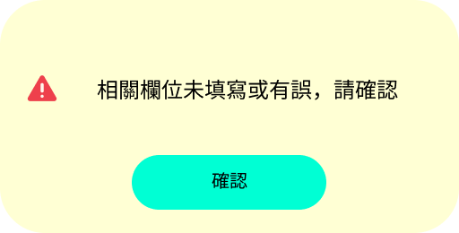

# Hint Component

## I. 需求簡介

提供開發者一個提示訊息的Component，根據不同條件顯示"警告"或"提示"訊息給使用者

## II. 需求說明

- CSS需要有RWD功能
- Props設定:
  - Title: 可提供開發者設定提示訊息的Title文字
  - Type: 可提供開發者設定提示訊息的Type，Type有兩種選擇:**info**或**warning**
    - info: 使用Info icon並顯示內容
    - warning: 使用Warning icon並顯示內容
- Button的Text固定為"確認"，點擊後關閉提示訊息
- 排版格式: [Icon] [Title]

## III. 前端顯示畫面



## IV. React範例說明

```jsx
import React from "react";
import "./WarningModal.css";

function WarningModal({ message = "相關欄位未填寫或有誤，請確認", onConfirm }) {
  return (
    <div className="warning-modal">
      <div className="warning-modal__content">
        
        <p className="warning-modal__message">{message}</p>
      </div>
      <button className="warning-modal__button" onClick={onConfirm}>
        確認
      </button>
    </div>
  );
}

export default WarningModal;
```

## V. CSS範例說明

```css
.warning-modal {
  position: relative;
  width: 512px;
  height: 260px;
  background-color: rgba(255, 255, 0, 0.17);
  border-radius: 50px;
  display: flex;
  flex-direction: column;
  align-items: center;
}

.warning-modal__content {
  display: flex;
  align-items: center;
  gap: 38px;
  margin-top: 76px;
  padding: 0 24px;
}

.warning-modal__icon {
  width: 46px;
  height: 46px;
  flex-shrink: 0;
}

.warning-modal__message {
  font-family: "Kalam", cursive;
  font-size: 24px;
  font-weight: 400;
  color: #000000;
  line-height: normal;
  margin: 0;
}

.warning-modal__button {
  display: inline-flex;
  align-items: center;
  justify-content: center;
  width: 217px;
  height: 61px;
  margin-top: 13px;
  background-color: #00ffd5;
  border: none;
  border-radius: 50px;
  font-family: "Kalam", cursive;
  font-size: 20px;
  font-weight: 400;
  color: #000000;
  cursor: pointer;
  transition: opacity 0.2s ease;
}

.warning-modal__button:hover {
  opacity: 0.85;
}

.warning-modal__button:active {
  opacity: 0.7;
}
```
