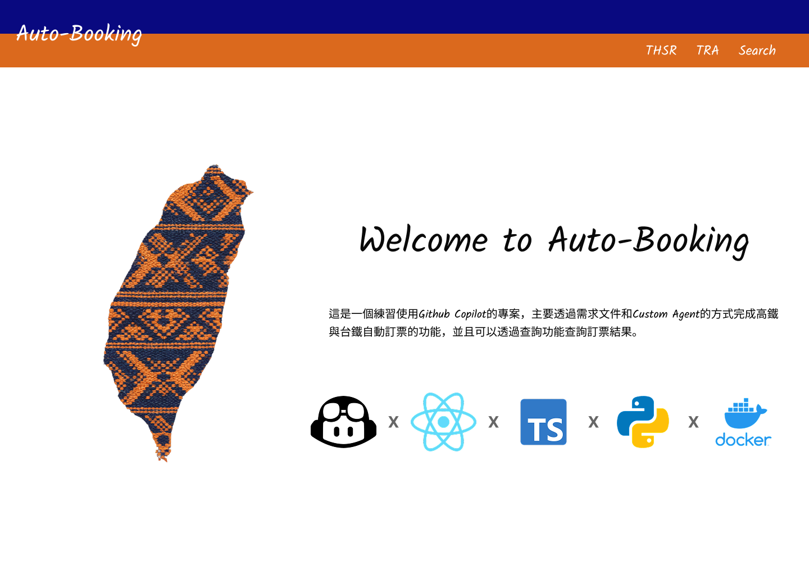

# 主畫面需求

## I. 需求簡介

自動訂票系統的主要畫面，使用者可以透過此畫面進行高鐵、台鐵、說明與查詢的操作頁面

## II. 需求說明

- CSS需要有RWD功能
- 字型: Kalam
- 頁面包含**Header**和**Content**兩個區塊
  - Header:
    - 底色使用: **#090980**和**DB691D**各一半，代表高鐵與台鐵的官方色彩
    - 左邊文字為: **Auto Booking**，點擊將可以回到首頁
    - 右邊文字為: **THSR**、**TRA**和**Search**
      - 點擊後會變成**粗體字**，並且無法再點擊
      - 滑鼠移動到文字上方，會顯示**底線**，代表可以點擊
    - Content:
      - Home Page:
        - 左半部份顯示台灣圖片: **public/images/taiwan.png**
        - 右半部份為說明，請參考:
          - Title: **Welcome To Auto Booking**
          - Description: 這是一個練習使用Github Copilot的專案，主要透過需求文件和Custom Agent的方式完成高鐵與台鐵自動訂票的功能，並且可以透過查詢功能查詢訂票結果。
          - 下方顯示此專案使用的技術能力icon: **public/images/tech-icons.png**
          - 相關顯示格式可參考**React範例說明**
      - THSR: 先顯示**作業中..**
      - TRA: 先顯示**作業中..**
      - Search: 先顯示**作業中..**
- 操作情境: [情境說明](../scenarios/HomePage.feature)

### III. 前端顯示畫面



### IV. React範例說明

```jsx
// HomePage.jsx
import React from "react";
import { Link } from "react-router-dom";
import "./HomePage.css";

import githubCopilotIcon from "./assets/github-copilot.png";
import reactIcon from "./assets/react.png";
import typescriptIcon from "./assets/typescript.png";
import pythonIcon from "./assets/python.png";
import dockerIcon from "./assets/docker.png";

function HomePage() {
  return (
    <div className="homepage">
      {/* Header */}
      <header className="homepage__header">
        <div className="homepage__header-tra" />
        <div className="homepage__header-thsr" />
        <span className="homepage__logo">Auto-Booking</span>
        <nav className="homepage__nav">
          <Link to="/thsr" className="homepage__nav-link">
            THSR
          </Link>
          <Link to="/tra" className="homepage__nav-link">
            TRA
          </Link>
          <Link to="/search" className="homepage__nav-link">
            Search
          </Link>
        </nav>
      </header>

      {/* Hero Section */}
      <main className="homepage__content">
        <h1 className="homepage__title">Welcome to Auto-Booking</h1>
        <p className="homepage__description">
          這是一個練習使用Github Copilot的專案，主要透過需求文件和Custom
          Agent的方式完成高鐵與台鐵自動訂票的功能，並且可以透過查詢功能查詢訂票結果。
        </p>

        {/* Tech Stack Icons */}
        <div className="homepage__tech-stack">
          
          <span className="homepage__tech-separator">X</span>
          
          <span className="homepage__tech-separator">X</span>
          
          <span className="homepage__tech-separator">X</span>
          
          <span className="homepage__tech-separator">X</span>
          
        </div>
      </main>
    </div>
  );
}

export default HomePage;
```

### V. CSS範例說明

```css
/* HomePage.css */
.homepage {
  width: 1440px;
  min-height: 1024px;
  background: #ffffff;
  position: relative;
}

/* ── Header ── */
.homepage__header {
  position: relative;
  width: 100%;
  height: 120px;
  display: flex;
  align-items: flex-end;
  padding: 0 28px;
}

.homepage__header-tra {
  position: absolute;
  top: 0;
  left: 0;
  width: 100%;
  height: 60px;
  background: #090980;
}

.homepage__header-thsr {
  position: absolute;
  top: 60px;
  left: 0;
  width: 100%;
  height: 60px;
  background: #db691d;
}

.homepage__logo {
  position: relative;
  z-index: 1;
  font-family: "Kalam", cursive;
  font-weight: 400;
  font-size: 40px;
  color: #ffffff;
  line-height: 120px;
}

.homepage__nav {
  position: relative;
  z-index: 1;
  margin-left: auto;
  display: flex;
  align-items: center;
  gap: 30px;
  padding-bottom: 15px;
}

.homepage__nav-link {
  font-family: "Kalam", cursive;
  font-weight: 400;
  font-size: 24px;
  color: #ffffff;
  text-decoration: none;
  transition: opacity 0.2s;
}

.homepage__nav-link:hover {
  opacity: 0.8;
}

/* ── Content ── */
.homepage__content {
  display: flex;
  flex-direction: column;
  align-items: center;
  padding-top: 260px;
}

.homepage__title {
  font-family: "Kalam", cursive;
  font-weight: 400;
  font-size: 64px;
  color: #090909;
  margin: 0;
}

.homepage__description {
  font-family: "Kalam", cursive;
  font-weight: 400;
  font-size: 20px;
  color: #000000;
  text-align: center;
  max-width: 808px;
  margin-top: 70px;
  line-height: 1.4;
}

/* ── Tech Stack ── */
.homepage__tech-stack {
  display: flex;
  align-items: center;
  gap: 20px;
  margin-top: 90px;
}

.homepage__tech-icon {
  width: 117px;
  height: 117px;
  object-fit: contain;
}

.homepage__tech-separator {
  font-family: "Inter", sans-serif;
  font-weight: 700;
  font-size: 28px;
  color: #666666;
}
```
