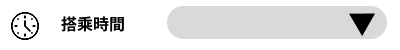

# 下拉選單Component

## I. 需求簡介

提供使用者可以透過下拉選單進行選擇，並且開發者可以根據需求設定選項內容，當使用者選擇下拉選單的選項時，會觸發onChange事件，並且回傳目前的選擇狀態給父層元件使用。

## II. 需求說明

- CSS需要有RWD功能
- Props設定:
  - Icon: 可提供開發者放入不同的icon顯示
  - Title: 可提供開發者設定下拉選單的Title文字
  - parm_category: 可提供開發者設定下拉選單的parm_category值，並且固定使用API-**/loading-selected?parm_category={parm_category}**，拿回選單資料，加上**請選擇**的預設值後，進行Lable與Value值的設定
  - 是否為必填，預設為True
- 排版格式: [Icon] [Title] [下拉選單]
- OnChange事件:
  - 當使用者選擇下拉選單的選項時，會觸發onChange事件，並且回傳目前的選擇狀態給父層元件使用
  - 回傳的資料格式為文字，如果是使用者有進行選擇，則回傳選擇的value值，例如"Value1"，若使用者沒有選擇任何選項，則根據開發者設定而決定
    - 必填: 錯誤訊息"請至少選擇一個選項"，並且需要將下拉選單標記為紅色，並且回傳空字串""
    - 不是必填:回傳空字串""

### III. 前端顯示畫面



### IV. React範例說明

```jsx
// TimePicker.jsx
import React, { useState } from "react";
import "./TimePicker.css";

function TimePicker() {
  const [time, setTime] = useState("");
  const [isOpen, setIsOpen] = useState(false);

  const timeOptions = [
    "08:00",
    "08:30",
    "09:00",
    "09:30",
    "10:00",
    "10:30",
    "11:00",
    "11:30",
    "12:00",
    "12:30",
    "13:00",
    "13:30",
    "14:00",
    "14:30",
    "15:00",
    "15:30",
    "16:00",
    "16:30",
    "17:00",
    "17:30",
  ];

  const handleSelect = (value) => {
    setTime(value);
    setIsOpen(false);
  };

  return (
    <div className="time-picker">
      
      <span className="time-picker__label">搭乘時間</span>
      <div className="time-picker__select-wrapper">
        <button
          className="time-picker__select"
          onClick={() => setIsOpen(!isOpen)}
        >
          <span className="time-picker__value">{time || ""}</span>
          <span className="time-picker__arrow">▼</span>
        </button>
        {isOpen && (
          <ul className="time-picker__dropdown">
            {timeOptions.map((opt) => (
              <li
                key={opt}
                className="time-picker__option"
                onClick={() => handleSelect(opt)}
              >
                {opt}
              </li>
            ))}
          </ul>
        )}
      </div>
    </div>
  );
}

export default TimePicker;
```

### V. CSS範例說明

```css
/* TimePicker.css */
.time-picker {
  position: relative;
  width: 400px;
  height: 50px;
  background: #ffffff;
  display: flex;
  align-items: center;
}

.time-picker__icon {
  width: 28px;
  height: 28px;
  margin-left: 11px;
}

.time-picker__label {
  font-family: "Kalam", cursive;
  font-weight: 700;
  font-size: 16px;
  color: #000000;
  margin-left: 22px;
}

.time-picker__select-wrapper {
  position: relative;
  margin-left: 42px;
}

.time-picker__select {
  width: 220px;
  height: 33px;
  background: #d9d9d9;
  border: none;
  border-radius: 20px;
  padding: 0 40px 0 16px;
  font-size: 14px;
  cursor: pointer;
  display: flex;
  align-items: center;
  justify-content: space-between;
  outline: none;
}

.time-picker__value {
  font-family: "Kalam", cursive;
  font-size: 14px;
  color: #000000;
}

.time-picker__arrow {
  position: absolute;
  right: 12px;
  top: 50%;
  transform: translateY(-50%);
  font-size: 10px;
  color: #000000;
  pointer-events: none;
}

.time-picker__dropdown {
  position: absolute;
  top: 38px;
  left: 0;
  width: 220px;
  max-height: 200px;
  overflow-y: auto;
  background: #ffffff;
  border: 1px solid #d9d9d9;
  border-radius: 10px;
  list-style: none;
  margin: 0;
  padding: 4px 0;
  z-index: 10;
  box-shadow: 0 4px 12px rgba(0, 0, 0, 0.1);
}

.time-picker__option {
  padding: 8px 16px;
  font-family: "Kalam", cursive;
  font-size: 14px;
  color: #000000;
  cursor: pointer;
}

.time-picker__option:hover {
  background: #f0f0f0;
}
```
