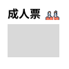

# 購買票數Component

## I. 需求簡介

提供使用者可以輸入購買的票數，並且可以限制輸入最大值與最小值，當輸入不符合預期時，會顯示錯誤訊息，並且限制使用者只能輸入數字。

## II. 需求說明

- CSS需要有RWD功能
- icon需置中放置，可提供開發者放入不同的icon顯示
- Title: 由開發者提供
- Textbox:
  - Type: number
  - Min: 提供開發者設定，預設為0
  - Max: 提供開發者設定，預設為10
- 檢查開發者須設定icon與Title，若未設定則回傳錯誤訊息，並且停止Component的渲染
- Textbox輸入值需要讓開發者可以透過onChange事件取得，並且回傳數字給父層元件使用

### III. 前端顯示畫面


### IV. React範例說明
```jsx
// Tickets.jsx
import React, { useState } from "react";
import "./Tickets.css";

function Tickets({ label = "成人票" }) {
    const [count, setCount] = useState(0);

    const increment = () => setCount((prev) => prev + 1);
    const decrement = () => setCount((prev) => Math.max(0, prev - 1));

    return (
    <div className="tickets">
        <div className="tickets__header">
        <span className="tickets__label">{label}</span>
        
        </div>
        <div className="tickets__counter">
        <button
            className="tickets__btn"
            onClick={decrement}
            aria-label="減少"
        >
            −
        </button>
        <span className="tickets__count">{count}</span>
        <button
            className="tickets__btn"
            onClick={increment}
            aria-label="增加"
        >
            +
        </button>
        </div>
    </div>
    );
}

export default Tickets;
```

### V. CSS範例說明

```css
/* Tickets.css */
.tickets {
    width: 100px;
    height: 100px;
    background: #ffffff;
    position: relative;
}

.tickets__header {
    display: flex;
    align-items: center;
    justify-content: space-between;
    padding: 9px 14px 0 11px;
}

.tickets__label {
    font-family: "Kalam", cursive;
    font-weight: 700;
    font-size: 16px;
    color: #000000;
}

.tickets__icon {
    width: 20px;
    height: 20px;
}

.tickets__counter {
    width: 75px;
    height: 48px;
    margin: 0 0 0 11px;
    background: #d9d9d9;
    display: flex;
    align-items: center;
    justify-content: space-between;
    padding: 0 8px;
}

.tickets__btn {
    width: 24px;
    height: 24px;
    border: none;
    background: transparent;
    font-size: 18px;
    cursor: pointer;
    display: flex;
    align-items: center;
    justify-content: center;
    color: #000000;
    padding: 0;
}

.tickets__btn:hover {
    opacity: 0.6;
}

.tickets__count {
    font-family: "Kalam", cursive;
    font-weight: 700;
    font-size: 16px;
    color: #000000;
}
```
   
